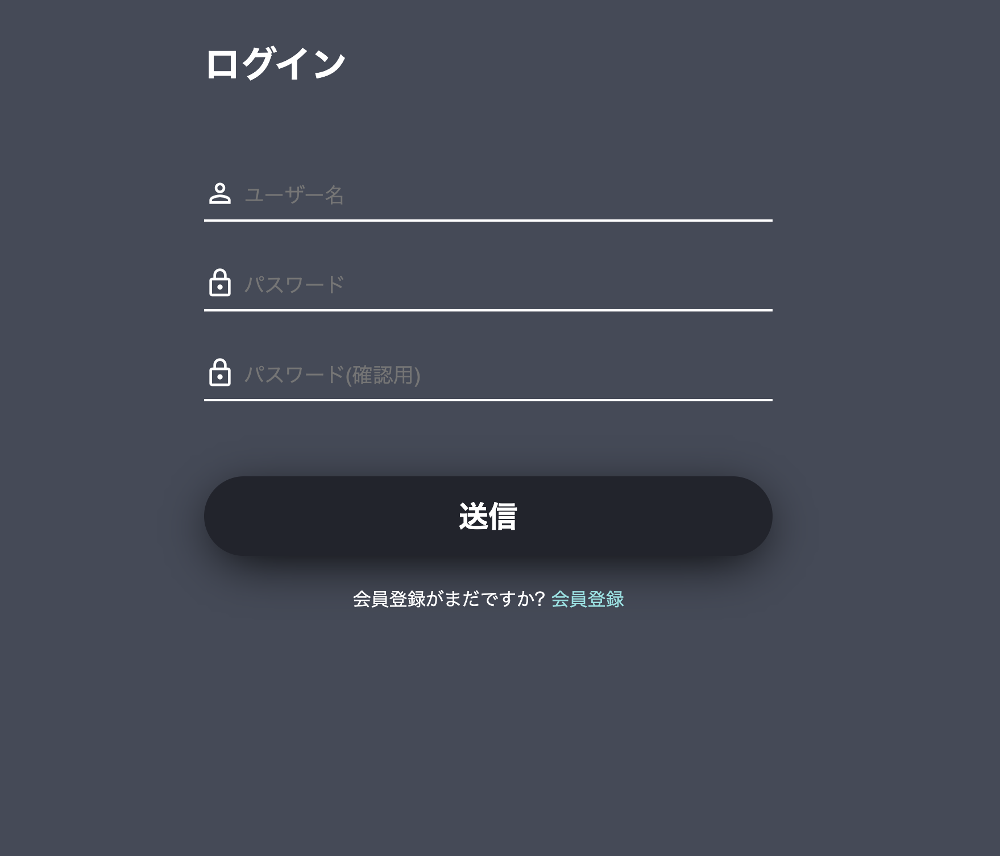
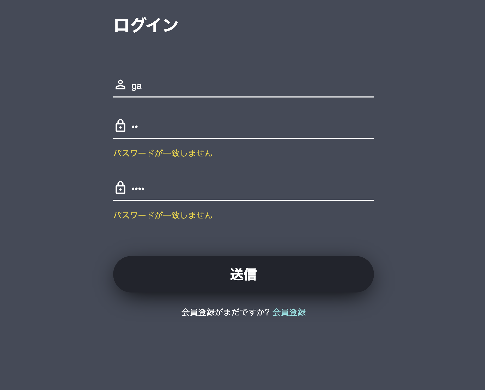
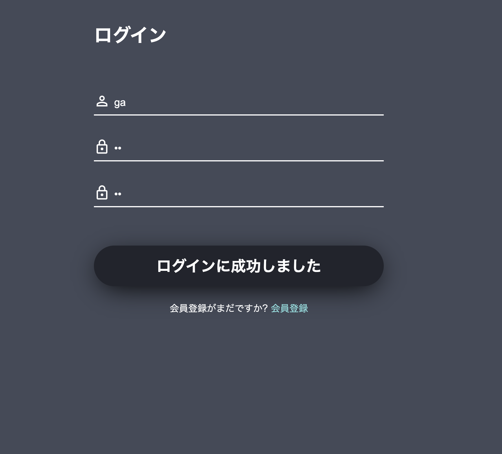

[ゼミ](/../../index.md)/[webアプリの基礎①](/../index.md)/[JavaScript について学ぶ](./index.md)/Web で使うテクニック

## 【追加課題】フォームの入力値をチェックする

今回作成するフォームのイメージです。





### 課題の説明
今回はパスワードとパスワード確認用が一致するかどうかの入力チェック(これを**バリデーション**といいます。)

- `JavaScript/lesson04/form_validation/`フォルダを作成し、その中に`index.html`,`style.css`,`script.js`を配置する。
- `index.html`,`style.css`に以下をコピーして貼り付ける。
- フォームの「送信」ボタンが押されたら、フォームの送信を一時停止して、「パスワード」と「パスワード確認用」が一致することを確認し、一致しなければ写真２枚目のように「パスワードが一致しません」というエラーを表示し、一致すれば３枚目の写真のようにボタンの表示を「ログインに成功しました」に変更する。
- JSは全て`script.js`に書く。

#### ヒント
1. formの送信をキャンセルする(通常は`<form>`タグ内のボタンが押されたら、自動で送信される)
```javascript
// まずはformタグを取得する
const form = document.querySelector('form');
// formが送信され(ようとした)時に、関数を実行する
form.addEventListener('submit', (event) => {
    event.preventDefault();
});
```
2. 入力されたパスワードをそれぞれ取得するには？(パスワードが入力されているフィールドは`.form__field--password1 input`のような**クエリセレクター**を用いて指定できる)
3. エラーを表示するには?(`<p class="form__field--error"></p>`タグ内にエラーメッセージを追加するには？)
4. ログイン成功メッセージを表示するには？(` <button type="submit">送信</button>`タグ内にエラーメッセージを追加するには？)


#### `index.html`
```html
<!DOCTYPE html>
<html lang="ja">

<head>
    <meta charset="UTF-8">
    <meta name="viewport" content="width=device-width, initial-scale=1.0">
    <title>Log In</title>
    <link rel="stylesheet" href="style.css">
    <link rel="preconnect" href="https://fonts.googleapis.com">
    <link rel="preconnect" href="https://fonts.gstatic.com" crossorigin>
    <link
        href="https://fonts.googleapis.com/css2?family=Merriweather:ital,wght@0,300;0,400;0,700;0,900;1,300;1,400;1,700;1,900&display=swap"
        rel="stylesheet">
    <link href="https://fonts.googleapis.com/css2?family=Material+Symbols+Outlined" rel="stylesheet" />

</head>

<body>
    <div class="title">
        <h1>ログイン</h1>
    </div>
    <form class="form">
        <!--ユーザー名  -->
        <div class="form__field form__field--username">
            <div class="form__field--input">
                <span class="material-symbols-outlined">
                    person
                </span>
                <input type="text" required placeholder="ユーザー名" name="username">
            </div>
            <p class="form__field--error"></p>
        </div>

        <!-- パスワード -->
        <div class="form__field form__field--password1">
            <div class="form__field--input">
                <span class="material-symbols-outlined">
                    lock
                </span>
                <input type="password" required placeholder="パスワード" name="password1">
            </div>
            <p class="form__field--error"></p>
        </div>
        <!-- パスワード確認用 -->
        <div class="form__field form__field--password2">
            <div class="form__field--input">
                <span class="material-symbols-outlined">
                    lock
                </span>
                <input type="password" required placeholder="パスワード(確認用)" name="password2">
            </div>
            <p class="form__field--error"></p>
        </div>

        <!-- 送信ボタン -->
        <div class="form__button">
            <button type="submit">送信</button>
            <p>
                会員登録がまだですか? <a href="#">会員登録</a>
            </p>
        </div>

    </form>
    <script src="script.js"></script>
</body>

</html>
```

#### `style.css`

```css
a {
  text-decoration: none;
  color: rgb(132, 225, 225);
}

body {
  color: white;
  background-color: #444a58;
  width: 70vw;
  margin: auto;
  display: flex;
  flex-direction: column;
  align-items: center;
  max-width: 500px;
  font-family: "Roboto", sans-serif;
}

body .title {
  align-self: flex-start;
  font-weight: 700;
  margin-top: 30px;
  margin-bottom: 50px;
}

body form {
  width: 100%;
  display: flex;
  flex-direction: column;
  align-items: center;
  gap: 20px;
}

body form .form__field {
  width: 100%;
}

body form .form__field--input {
  position: relative;
}

body form .form__field--input>span {
  position: absolute;
  top: 4px;
  font-size: 28px;
}

body form .form__field--input>input {
  width: 100%;
  border: none;
  background-color: #444a58;
  border-bottom: 2px solid white;
  padding: 10px 10px 10px 35px;
  box-sizing: border-box;
  color: white;
  transition: 0.2s;
  font-size: 18px;
}

body form .form__field--input>input:focus {
  border: none;
  outline: 0;
  border-bottom: 2px solid #edd325;
}

body form .form__field .form__field--error {
  color: #edd325;
}

body form .form__button {
  margin-top: 30px;
  width: 100%;
  text-align: center;
}

body form .form__button>button {
  margin-bottom: 10px;
  background-color: #21242d;
  color: white;
  border: none;
  width: 100%;
  border-radius: 50px;
  height: 70px;
  font-size: 26px;
  box-shadow: 0px 10px 45px -10px black;
  font-weight: 800;
}
```


###　解答例

#### `script.js`
```javascript

// まずはformタグを取得する
const form = document.querySelector('.form');
// formが送信され(ようとした)時に、関数を実行する
form.addEventListener('submit', (e) => {
    // 自動で実行されるフォームの送信を一時停止する
    e.preventDefault();
    if (isValid()) {
        // 本来は送信するところ
        // form.submit();
        showSuccessMessage();
    } else {
        showErrorMessage();
    }
});
/**
 * フォームの入力に問題がないか確認する(バリデーション)関数
 * 今回は二つのpasswordが一致するか確認している
 */
function isValid() {
    const password1Input = document.querySelector(
        '.form__field--password1 input'
    ).value;
    const password2Input = document.querySelector(
        '.form__field--password2 input'
    ).value;
    return password1Input === password2Input;
}

/**
 * パスワードが一致しないことをエラーとして表示する関数
 */
function showErrorMessage() {
    const password1ErrorMessageTag = document.querySelector(
        '.form__field--password1 .form__field--error'
    );
    const password2ErrorMessageTag = document.querySelector(
        '.form__field--password2 .form__field--error'
    );
    password1ErrorMessageTag.textContent = 'パスワードが一致しません';
    password2ErrorMessageTag.textContent = 'パスワードが一致しません';
}
/**
 * ログインに成功したことをメッセージとして表示する関数
 */
function showSuccessMessage() {
    const loginButton = document.querySelector('.form__button button');
    loginButton.textContent = 'ログインに成功しました';
}

```