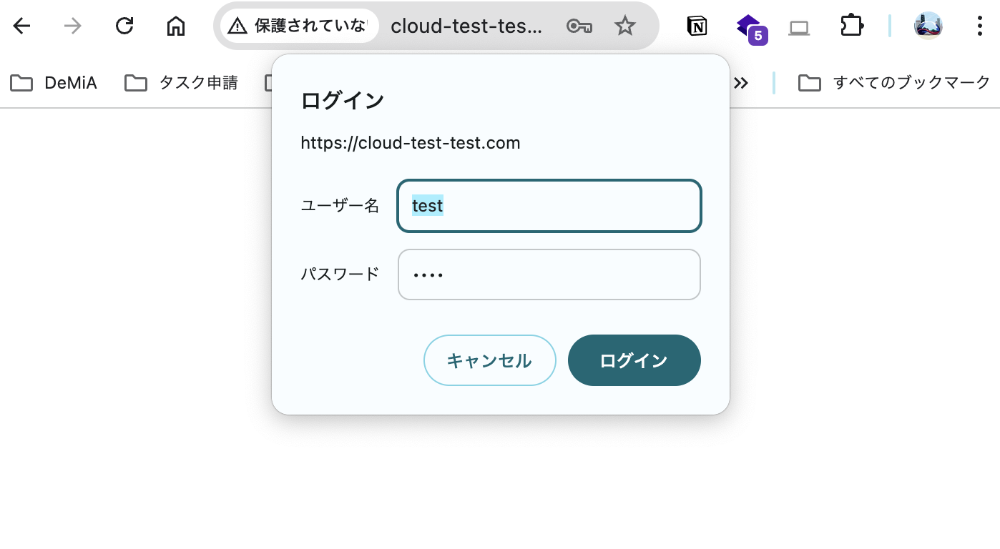

[ゼミ](../../index.md)/[webアプリの基礎②](../index.md)/[Gitの基礎とデプロイ](./index.md)/[デプロイ](./aws-deploy.md)
## デプロイの設定を変更した時

デプロイが失敗した時には、元々書いていた設定を変更することがあると思います。ここで注意しないとけないのが、特定のファイルを変更したとしても適切な手続きを行わないと設定が更新されないということです。[このページ](https://qiita.com/A-nkt/items/d6cb5c643d416a48896d)を参考にしてください。

## vscode で ssh 接続する

EC2 を用いたデプロイにおいて、特定のファイルを編集する際は教科書で紹介されている`nano`や`vim`などのターミナル上で利用可能なエディターを使うことになります。使ってみるとわかると思いますが、vscode を触っている時には当たり前だった入力補完機能がなかったり、クリックでカーソル移動ができなかったりとなかなか不便な点も多くあります。以下では、 vscode を用いて EC2 インスタンスに ssh 接続する方法について説明します。

### 手順

手順については[このページ](https://zenn.dev/aew2sbee/articles/aws-ec2-vscode)を参考にするといいと思います。若干 aws の UI(見た目)がサイトの画像と異なるので注意してください。

### EC2 で公開したページに basic 認証をつける

`basic認証`とは、web 上の特定のサイトに対してのアクセスを制限する簡易的な方法です。basic 認証をサイトにつけると、アクセスしたときに、以下のようなモーダルが開き、ユーザー名とパスワードの入力を求められます。あらかじめ設定しておいたユーザー名とパスワードを入力することで、サイトを利用できるようになります。開発を行う中で一般公開したくはないが、実際にサービスを提供する環境でテストを行いたいことがあります。そういった時に非常に有用です。
<br>
<br>


### 導入方法

では、EC2 を用いてデプロイしたチャットアプリに Basic 認証をつけてみましょう。
以下の説明では、チャットアプリをデプロイし後、ssh 接続した状態を想定しています。

1. htpasswd コマンドを利用するためのパッケージをインストール

   ```bash
   $ sudo apt-get install apache2-utils
   ```

2. .htpasswd ファイルの作成

   ```bash
   $ sudo htpasswd -c /etc/nginx/.htpasswd [username]
   >>> `New password: [password]`
   >>> `Re-type new password: [password]`
   >>> `Adding password for user [username]`
   ```

3. .htpasswd ファイルの読み込み設定

   1. `/etc/nginx/sites-available/chatapp` の http ブロック内の server ブロックに以下を追加します。(教科書に沿ってデプロイした時に作成したファイルです。)

   ```nginx
   server {
       listen 80;
       root /usr/share/nginx/html;
       index index.html index.htm;

       location / {
           # 以下2行を追加する
           auth_basic "Restricted";                   # 認証時に表示されるメッセージ
           auth_basic_user_file /etc/nginx/.htpasswd; # .htpasswdファイルのパス
       }
   }
   ```

4. Nginx を再起動

   ```bash
   # リロード
   $ sudo systemctl reload nginx
   # 再起動
   $ sudo systemctl restart nginx
   ```

5. 確認<br>
   ここまでできたらデプロイしたページに(シークレットモードで)アクセスしてみてください。Basic 認証がかかっているはずです。
