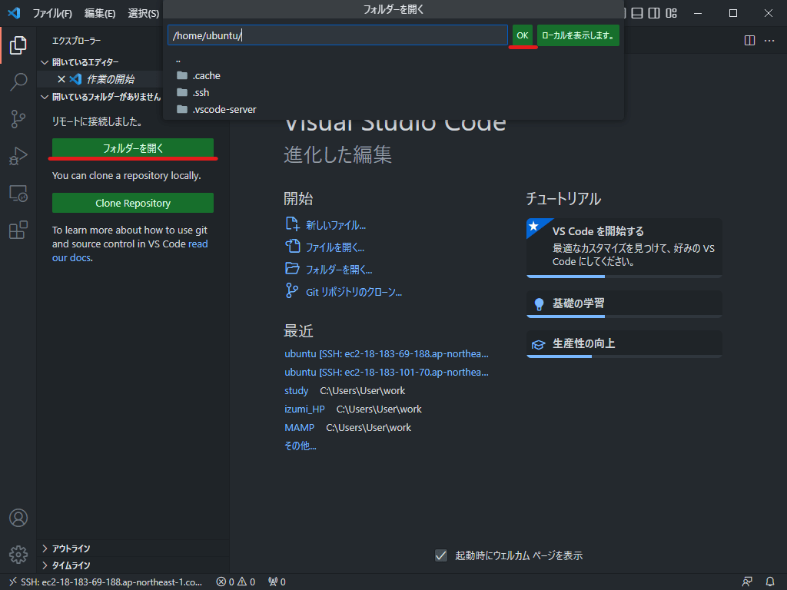

## vscode でインスタンスに ssh 接続する

EC2 を用いたデプロイにおいて、特定のファイルを編集する際は教科書で紹介されている`nano`や`vim`などのターミナル上で利用可能なエディターを使うことになります。使ってみるとわかると思いますが、vscode を触っている時には当たり前だった入力補完機能がなかったり、クリックでカーソル移動ができなかったりとなかなか不便な点も多くあります。以下では、 vscode を用いて EC2 インスタンスに ssh 接続する方法について説明します。

### 手順

手順については[このページ](https://zenn.dev/aew2sbee/articles/aws-ec2-vscode)を参考にするといいと思います。若干 aws の UI(見た目)がサイトの画像と異なるので注意してください。

